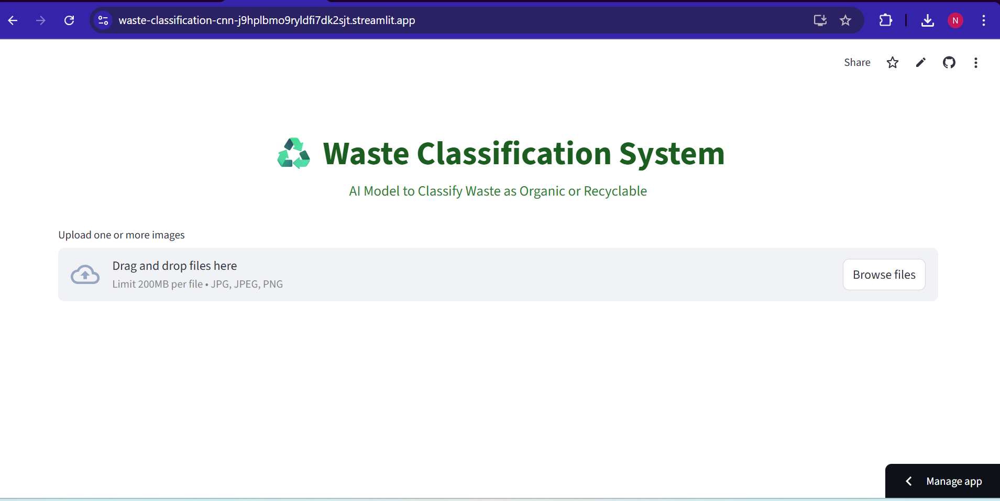
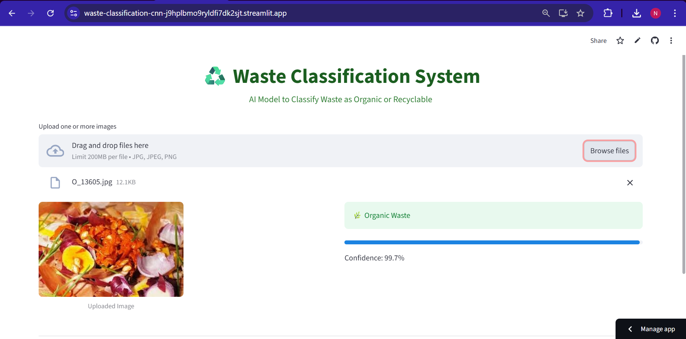
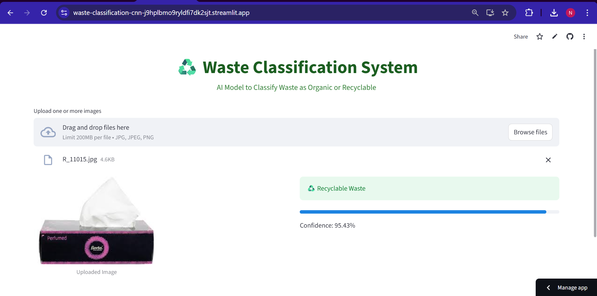

# Waste Classification using Deep Learning (CNN)

## Live Application
**Deployed on Streamlit Cloud:**  
https://waste-classification-cnn-j9hplbmo9ryldfi7dk2sjt.streamlit.app/

---

## Project Overview

This project presents a Deep Learning-based Waste Classification System developed using Convolutional Neural Networks (CNN).  

The application classifies waste images into:

- Organic Waste  
- Recyclable Waste  

The system is deployed as an interactive web application using Streamlit, enabling real-time predictions from uploaded images.

---

## Problem Statement

Improper waste segregation is a major environmental challenge. Manual sorting is inefficient and error-prone.  

This project aims to automate waste classification using Computer Vision and Deep Learning techniques to support smart waste management systems.

---

## Model Architecture

The model is built using TensorFlow and Keras with a Convolutional Neural Network architecture consisting of:

- Convolutional Layers
- ReLU Activation
- MaxPooling Layers
- Fully Connected Dense Layers
- Sigmoid Output Layer (Binary Classification)

Input Image Size: 128 × 128  
Output: Binary classification (Organic / Recyclable)

---

## Model Performance

- Validation Accuracy: **83.31%**
- Loss Function: Binary Crossentropy
- Optimizer: Adam
- Framework: TensorFlow / Keras

The model achieves stable performance and generalizes reasonably well on validation data.

---

## Tech Stack

- Python
- TensorFlow / Keras
- Streamlit
- NumPy
- Pillow (PIL)
- Google Drive (Model Hosting)
- Git & GitHub

---

## Application Features

- Upload one or multiple waste images
- Real-time prediction
- Confidence score display
- Clean and user-friendly interface
- Cloud deployment using Streamlit

---

## Project Structure

```
waste-classification-cnn/
│
├── app.py
├── requirements.txt
├── README.md
├── .gitignore
└── images/
```

Note: The trained model file is hosted externally and loaded dynamically.

---

## How to Run the Project Locally

### 1. Clone the Repository

```bash
git clone https://github.com/HarshadaGodse29/waste-classification-cnn.git
cd waste-classification-cnn
```

### 2. Create Virtual Environment (Recommended)

```bash
python -m venv venv
venv\Scripts\activate
```

### 3. Install Dependencies

```bash
pip install -r requirements.txt
```

### 4. Run the Application

```bash
streamlit run app.py
```

---

## Screenshots

### Home Interface


### Prediction Output


### Prediction Output


---

## Future Improvements

- Multi-class waste classification (Plastic, Metal, Glass, Paper)
- Model accuracy improvement using transfer learning
- Mobile-friendly interface
- Integration with IoT-based smart bins

---

## Author

**Harshada Godse**  
B.E. Artificial Intelligence & Machine Learning  
Passionate about AI, Deep Learning, and Computer Vision  

LinkedIn:  
GitHub: https://github.com/HarshadaGodse29

---

## License

This project is developed for educational and learning purposes.
